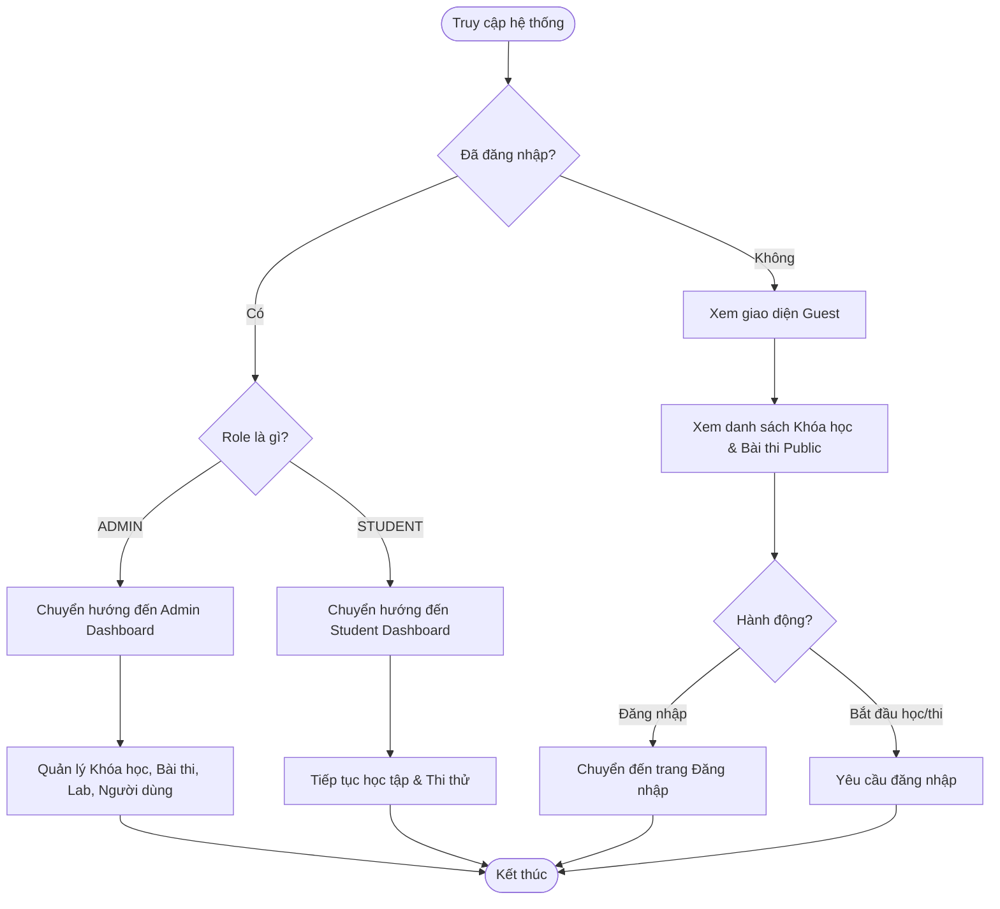
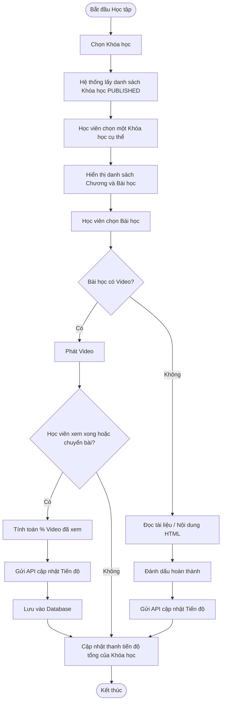
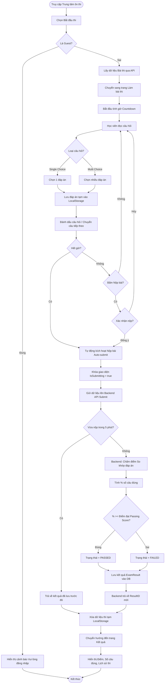
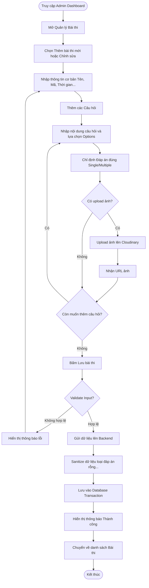
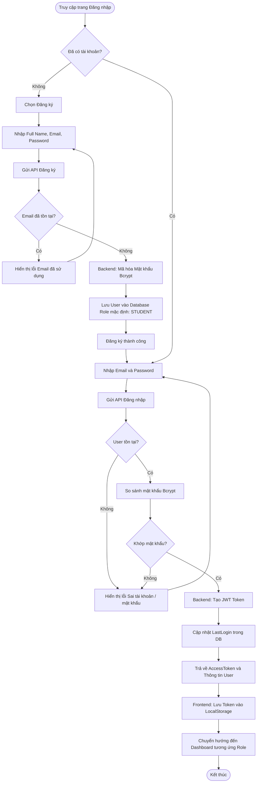

# Sơ đồ Luồng nghiệp vụ (Activity Diagram) - CCNA Learning Platform

Dưới đây là tài liệu phân tích luồng nghiệp vụ chi tiết kèm theo mã Mermaid để bạn có thể chèn trực tiếp vào các công cụ vẽ sơ đồ (như Draw.io, Mermaid Live Editor, Notion, v.v.).

## 1. Luồng Tổng quan Hệ thống (System Overview Flow)

Luồng này mô tả cách người dùng truy cập vào hệ thống và sự phân nhánh dựa trên trạng thái đăng nhập và vai trò (Role).

---

## 2. Luồng Học tập (Learning Flow - Học viên)

Mô tả quá trình học viên xem khóa học, xem video bài giảng và hệ thống lưu lại tiến độ.

---

## 3. Luồng Thi thử (Exam Flow) - QUAN TRỌNG NHẤT

Đây là luồng nghiệp vụ phức tạp nhất, bao gồm điều kiện phân nhánh về thời gian, chống gian lận và chấm điểm.

---

## 4. Luồng Quản lý Bài thi (Admin Management Flow)

Luồng của Admin khi tạo hoặc chỉnh sửa một bài thi mới.

## 5. Luồng Đăng nhập & Đăng ký (Authentication Flow)

Hệ thống CCNA Learning Platform sử dụng JWT (JSON Web Token) để xác thực. Dưới đây là luồng xử lý đăng nhập và đăng ký cơ bản.

---

## Các Điều kiện Phân nhánh (Branching Conditions) Cốt lõi cần đưa vào tài liệu:

1. **Điều kiện Access Control (Phân quyền):**
   - `!req.user`: Guest -> Chỉ cho phép đọc các bản ghi có trạng thái `PUBLISHED` hoặc `OPEN`. Chặn hành động Create/Update/Delete và Nộp bài thi.
   - `req.user.role === 'STUDENT'`: Truy cập bình thường vào luồng học và thi.
   - `req.user.role === 'ADMIN'`: Thấy toàn bộ bản ghi (kể cả `DRAFT`), cho phép vào trang Admin, gọi các API thay đổi dữ liệu.

2. **Điều kiện Chấm điểm Bài thi (Grading Logic):**
   - **Multi-choice check**: Mảng đáp án chọn (`userAns`) phải có cùng độ dài với mảng đáp án đúng (`correctAns`) VÀ mọi phần tử của `userAns` phải nằm trong `correctAns`.
   - `isPassed = (correctCount / totalQuestions) * 100 >= exam.passingScore`.

3. **Điều kiện Chống Spam Nộp bài (Idempotency):**
   - Khi Backend nhận request `submitExam`, kiểm tra xem trong vòng 5 phút vừa qua (`takenAt: { gte: Date.now() - 5 phút }`), người dùng này đã nộp bài thi cho `examId` này chưa.
   - Nếu có: Bỏ qua chấm điểm, trả về luôn `id` của kết quả cũ để chống lặp dữ liệu do mạng lag bấm 2 lần.
